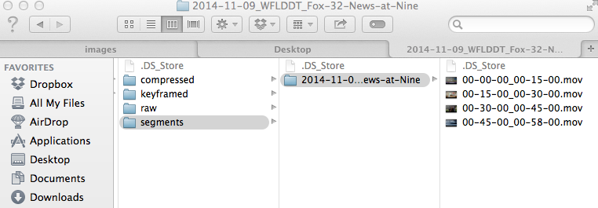
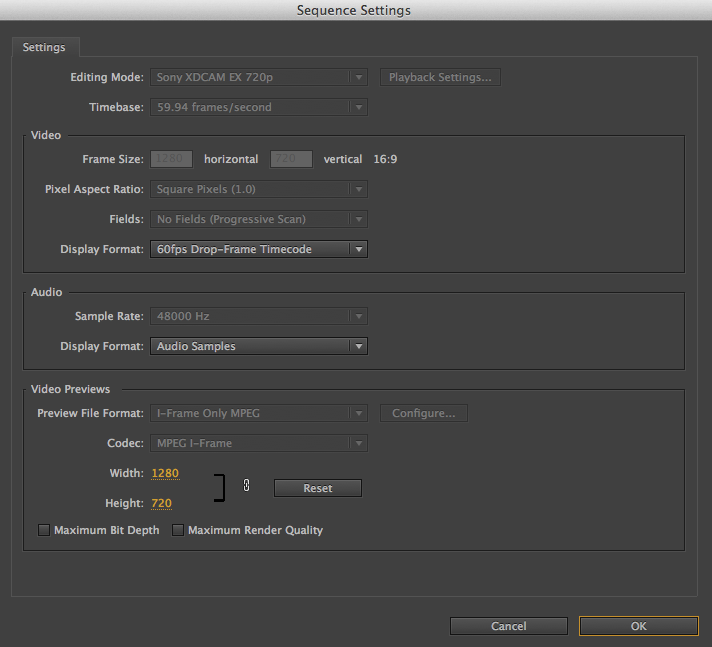

# Instructions

## Record Program on HDHomeRun

```
# set the channel
hdhomerun_config FFFFFFFF set /tuner<n>/channel <channel>

# set the program
hdhomerun_config FFFFFFFF set /tuner<n>/program <program>

# start recording
hdhomerun_config FFFFFFFF save /tuner<n> <YYYY-MM-DD_STATION_program-name.ts>
```

## Transcode to Motion JPEG in 15 min segments

Use the below script to splice raw transmission streams into 15 min mjpeg segments. 

```
ffmpeg -i /Volumes/Untitled/hdhomerun/video/programs/raw/<YYYY-MM-DD_STATION_program-name.ts> -c:v mjpeg -q:v 2 -r 59.94 -ss <HH:MM:SS> -to <HH:MM:SS> /Volumes/Untitled/hdhomerun/video/programs/segments/<YYYY-MM-DD_STATION_program-name>/<HH-MM-SS_HH-MM-SS.mov>
```



## Tag words

Use Premiere Pro to tag words from videos



## Cut segments into words

Copy and paste all timecodes into the following format in sublime:

```
00;00;00;48, 00;00;01;24
00;00;01;29, 00;00;01;54
00;00;44;54, 00;00;45;20
00;00;45;20, 00;00;45;34
00;00;45;35, 00;00;46;18
...
```

Generate a `list.txt` file to combine into a single video:

```
# if temp.txt already exists
rm temp.txt

# create list.txt
for f in ./clips/*.mov; do echo "file '$f'" >> temp.txt; done

# randomly sort list.txt
python -c "import random, sys; lines = open(sys.argv[1]).readlines(); random.shuffle(lines); print ''.join(lines)," temp.txt > list.txt

# remove temp.txt
rm temp.txt

```

Combine video using clips from list.txt:

```
# note, this uses libx264 by default. To copy as mjpeg use -c copy
ffmpeg -f concat -i list.txt -r 59.97 output_uniq.mov
```